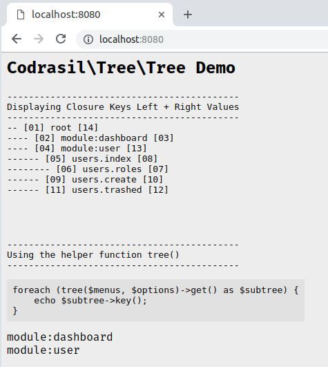

# Codrasil / Tree

[](https://packagist.org/packages/codrasil/tree)
[](https://packagist.org/packages/codrasil/tree)
[](https://packagist.org/packages/codrasil/tree)
[](https://packagist.org/packages/codrasil/tree)

PHP Library to generate a hierarchical tree list from array. Ideal for creating menus, sidebars, and any nested resources.

<br>

#### Requirements

* **php**: `>=7.1`

<br>

#### Installation

```bash
$ composer require codrasil/tree
```
```json
{
    "require": {
        "codrasil/tree": "^1.0.0"
    }
}
```

<br>

#### Usage

```php
use Codrasil\Tree\Tree;

$menus = [
  ['id' => 'menu:user', 'text' => 'Users', 'order' => 2, 'children' => [ ... ]],
  ['id' => 'menu:blog', 'text' => 'Blogs', 'order' => 1],
  ['id' => 'submenu:blog:category', 'parent' => 'menu:blog', 'text' => 'Blog Categories', 'order' => 1],
];

$options = [
  'key' => 'id',
  'parent' => 'parent',
  'children' => 'children',
];

$tree = new Tree($menus, $options);

$tree->build();

print_r($tree->get());
/*
output:

Array
(
    [menu:blog] => Codrasil\Tree\Branch Object
        (
            [key:protected] => menu:blog
            [parent:protected] => root
            [node:protected] => Array
                (
                    [name] => menu:blog
                    [parent] => root
                    [order] => 1
                    [children] => Array
                        (
                            [submenu:blog:category] => Codrasil\Tree\Branch Object
                                (
                                    ...
                                )
                        )
                    [left] => 2
                    [right] => 3
                )
        )
    [menu:user] => Codrasil\Tree\Branch Object ( ... )
*/
```

You may also run the demo inside the tests folder via cloning this repository, then starting a php server on the `tests/` folder.

```bash
cd /path/to/codrasil/tree
php -S localhost:8080 -t tests/
```


<br>

#### Documentation

coming soon

<br>

#### License

The Codrasil/Tree PHP library is open-source software licensed under the [MIT license](./LICENSE).
